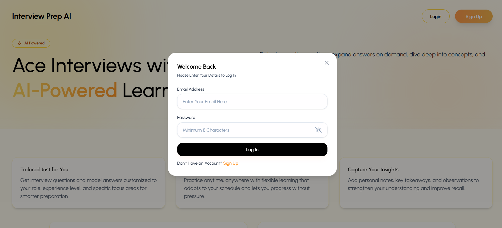
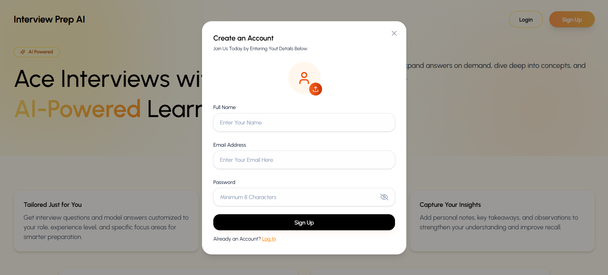
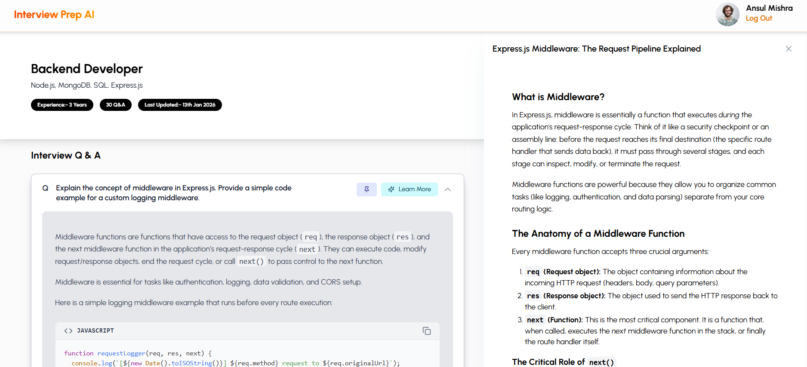

# 🚀 InterviewPrep AI – Smart, Role-Based Interview Preparation Platform

Interview Prep AI is a modern, AI-powered interview preparation platform that helps users prepare for role-specific interviews with personalized questions, detailed explanations, and structured learning journeys.

---

## 🌟 Features

- 🤖 AI-powered interview question generation
- 🎯 Role-based interview preparation
- 🧠 In-depth explanations with code examples
- 📊 Track experience level and progress
- 📝 Focus on specific topics and technologies
- 💻 Clean, responsive, and modern UI

---

## 🛠️ Tech Stack

## 🖥 Frontend

## ⚙️ Backend

## 💾 Database

## 📸 Screenshots & Pages

### 🏠 Interview Prep AI – Home

AI-powered platform to generate role-specific interview questions, explore concepts deeply, and prepare smarter for technical and professional interviews.

📷 Screenshot:

---

### 🔐 Interview Prep AI – Login

Securely log in to access your personalized interview sessions, saved progress, and AI-driven learning experience.

📷 Screenshot:

---

### 📝 Interview Prep AI – Sign Up

Create your account to unlock personalized interview preparation, role-based questions, and structured learning paths.

📷 Screenshot:

---

### 📊 Interview Prep AI – Dashboard

Manage all your interview preparation journeys in one place. View roles, experience level, number of questions, and last updates.

📷 Screenshot:

---

### ➕ Interview Prep AI – Create Interview Session

Start a new interview journey by selecting your target role, experience level, focus topics, and personal goals to generate customized questions.

📷 Screenshot:

---

### ❓ Interview Prep AI – Interview Q&A

Practice real interview questions with AI-generated answers, detailed explanations, and practical code examples for deeper understanding.

📷 Screenshot:

---

## 🌐 Live Project Demo

🚀 **Interview Prep AI – Live Application**  
Experience the full functionality of Interview Prep AI in real time. Generate role-specific interview questions, explore detailed answers, and manage your personalized interview preparation journey with an intuitive AI-powered interface.

🔗 **Live URL:**

  <a href="https://prepareinterview.vercel.app/" style="text-decoration:none;">
    <button style="
      padding:14px 32px;
      background:linear-gradient(90deg,#6366f1,#2563eb);
      color:white;
      border:none;
      border-radius:14px;
      font-size:16px;
      font-weight:600;
      cursor:pointer;
    ">
      🚀 Visit Interview Prep AI Live
    </button>
  </a>

✨ Built to help candidates prepare smarter, faster, and more confidently for real-world technical interviews.

---

## 🙌 Feedback & Contributions

Have suggestions or ideas to improve Interview Prep AI?  
Feel free to open an issue or submit a pull request. Contributions are always welcome! 🤝

---

⭐ **If you found this project useful, don’t forget to star the repository!**
